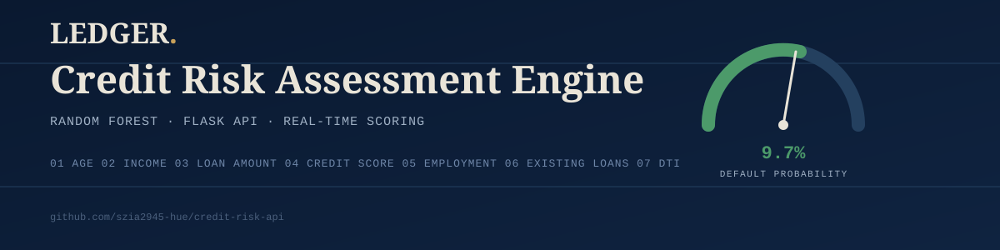
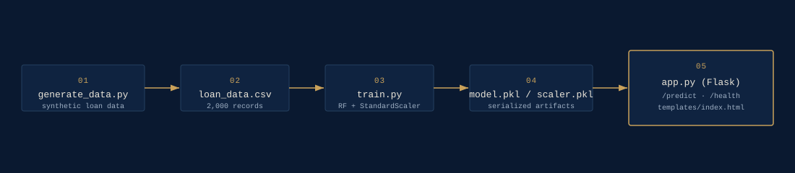

<p align="center">
  
</p>

<p align="center">
  
  
  
  
  
</p>

# Ledger — Credit Risk Assessment API

A machine-learning REST API that predicts the probability of a loan applicant
defaulting, served through a Flask backend with a real-time, browser-based
scoring dashboard. Built to demonstrate an end-to-end ML product: data
generation, model training and evaluation, API design, and a production-style
front end — not just a notebook.

**[Live demo](#) · [API reference](#-api-reference) · [Run locally](#️-getting-started)**

---

## Contents
- [Features](#-features)
- [Demo](#-demo)
- [Model performance](#-model-performance)
- [Architecture](#-architecture)
- [Project structure](#️-project-structure)
- [Getting started](#️-getting-started)
- [API reference](#-api-reference)
- [Testing](#-testing)
- [Deployment](#-deployment)
- [Tech stack](#-tech-stack)
- [Roadmap](#-roadmap)
- [License](#-license)

---

## ✨ Features

- **Random Forest classifier** trained on applicant financial data (income,
  credit score, debt-to-income, employment history, and more)
- **User accounts** — sign up / log in / log out with hashed passwords
  (Flask-Login + Werkzeug PBKDF2), sessions, and a "keep me signed in" option
- **Per-user assessment history** — every prediction a logged-in user runs is
  saved and viewable on a `/history` page, with one-click **CSV export**
- **REST API** (`POST /predict`) returning a default probability, binary
  prediction, and a Low / Medium / High risk classification — stays public
  and unauthenticated so it can be called from scripts, curl, or Postman
- **Rate limiting** on the prediction endpoint (30 requests/minute per IP) to
  prevent abuse
- **Live scoring dashboard** — a single-page UI where a submitted application
  animates onto a risk gauge in real time, no page reload
- **Dark / light theme toggle** — persisted across visits, no flash of the
  wrong theme on page load
- **History dashboard with stats** — total assessments, average default
  probability, and a Low/Medium/High risk distribution bar; delete
  individual records with one click
- **Responsive design** — collapsible mobile navigation, usable on phone-sized
  screens
- **Input validation** with clear, structured error responses
- **Health check endpoint** (`GET /health`) for uptime monitoring
- **Test suite** (11 tests) covering auth, access control, and the prediction
  API's happy paths and failure modes
- **Container-ready** with a production `Dockerfile` and Gunicorn entry point
- Clean, modular pipeline: `generate data → train → serve`

## 🎬 Demo

Fill in an applicant's financials and get an instant read-out: a semi-circular
gauge sweeps to the predicted default probability, color-coded by risk band,
alongside a breakdown of the key inputs.

<p align="center">
  
</p>

## 📊 Model Performance

Evaluated on a held-out 20% test split (stratified by outcome):

| Metric      | Score |
|-------------|-------|
| Accuracy    | 0.91  |
| Precision   | 0.81  |
| Recall      | 0.84  |
| F1 Score    | 0.82  |
| ROC AUC     | 0.97  |

> The dataset in this repo is synthetically generated (see
> [`generate_data.py`](generate_data.py)) so the pipeline can be demoed
> end-to-end without a licensing dependency. Swap in a real dataset (e.g. the
> Kaggle [Loan Prediction](https://www.kaggle.com/datasets/altruistdelhite04/loan-prediction-problem-dataset)
> or [German Credit Data](https://archive.ics.uci.edu/dataset/144/statlog+german+credit+data)
> sets) by matching its columns to `FEATURES` in `train.py` and re-running
> `python train.py`.

## 🏗 Architecture

```
generate_data.py  →  loan_data.csv  →  train.py  →  model.pkl + scaler.pkl  →  app.py (Flask)
                                                                                    │
                                                                    ┌───────────────┴───────────────┐
                                                                    │                                │
                                                            GET /  (dashboard)              POST /predict (JSON API)
```

## 🗂️ Project Structure

```
credit-risk-api/
├── app.py                  # App factory: routes, validation, inference, rate limiting
├── auth.py                  # Auth blueprint: signup / login / logout
├── extensions.py              # Shared extension instances (db, login manager, limiter)
├── models.py                    # SQLAlchemy models: User, Prediction
├── train.py                       # Trains RandomForestClassifier, evaluates, saves artifacts
├── generate_data.py                 # Synthetic dataset generator
├── loan_data.csv                       # Training data
├── model.pkl                             # Trained RandomForest model (joblib)
├── scaler.pkl                              # Fitted StandardScaler (joblib)
├── templates/
│   ├── base.html                            # Shared layout: navbar, flash messages, footer
│   ├── index.html                             # Live scoring dashboard (UI)
│   ├── login.html                               # Log in page
│   ├── signup.html                                # Sign up page
│   └── history.html                                 # Per-user assessment history
├── static/css/ledger.css                              # Shared theme
├── tests/
│   └── test_app.py                                      # Test suite (pytest)
├── docs/
│   ├── banner.svg                                         # README banner
│   └── architecture.svg                                     # Pipeline diagram
├── Dockerfile                                                 # Production container
├── .env.example                                                 # Template for SECRET_KEY / DATABASE_URL
├── requirements.txt                                               # Runtime dependencies
├── requirements-dev.txt                                             # + test dependencies
└── README.md
```

## ⚙️ Getting Started

### Prerequisites
- Python 3.11+
- pip

### Installation

```bash
# 1. Clone the repo
git clone https://github.com/szia2945-hue/credit-risk-api.git
cd credit-risk-api

# 2. Create a virtual environment (recommended)
python -m venv venv
source venv/bin/activate      # Windows: venv\Scripts\activate

# 3. Install dependencies
pip install -r requirements.txt

# 4. Set a secret key (used to sign login sessions)
cp .env.example .env
# then edit .env and set SECRET_KEY to a random value, e.g.:
python -c "import secrets; print(secrets.token_hex(32))"

# 5. (Optional) Regenerate data & retrain the model from scratch
python generate_data.py
python train.py

# 6. Run the app
python app.py
```

Open **http://127.0.0.1:5000** — you'll land on the login page. Sign up for a
free account to reach the dashboard and start scoring applications; each
assessment you run is saved to your `/history`. A local `ledger.db` SQLite
file is created automatically on first run to store accounts and history.

## 📡 API Reference

### Web routes (session-based, login required unless noted)

| Route | Method | Auth | Description |
|---|---|---|---|
| `/auth/signup` | GET/POST | Public | Create an account |
| `/auth/login` | GET/POST | Public | Log in |
| `/auth/logout` | GET | Login required | End the session |
| `/dashboard` | GET | Login required | Live scoring UI |
| `/history` | GET | Login required | Table of your past assessments + summary stats |
| `/history/export` | GET | Login required | Download history as CSV |
| `/history/<id>/delete` | POST | Login required | Delete a single assessment (owner only) |

### `POST /predict`

Scores a single applicant and returns a default probability. **Public** —
no login required, so it can be called directly from scripts or curl. If the
request is made with an active browser session (i.e. you're logged in), the
result is also saved to that user's history. Rate-limited to 30 requests per
minute per IP address.

**Request body** (JSON):

| Field               | Type  | Description                          |
|---------------------|-------|---------------------------------------|
| `age`                | number | Applicant age                        |
| `income`             | number | Gross annual income (USD)            |
| `loan_amount`        | number | Requested loan amount (USD)          |
| `credit_score`       | number | Credit score (300–850)               |
| `employment_years`   | number | Years in current employment          |
| `existing_loans`     | number | Number of existing open loans        |
| `debt_to_income`     | number | Total monthly debt ÷ monthly income  |

**Example request:**

```bash
curl -X POST http://127.0.0.1:5000/predict \
  -H "Content-Type: application/json" \
  -d '{
    "age": 35,
    "income": 55000,
    "loan_amount": 15000,
    "credit_score": 650,
    "employment_years": 5,
    "existing_loans": 1,
    "debt_to_income": 0.30
  }'
```

**Example response:**

```json
{
  "default_prediction": 0,
  "default_probability": 0.0972,
  "risk_level": "Low"
}
```

**Error response** (missing/invalid field, HTTP 400):

```json
{ "error": "Missing field: credit_score" }
```

### `GET /health`

Returns `{"status": "ok"}` — use for uptime checks / load balancer probes.

## 🧪 Testing

```bash
pip install -r requirements-dev.txt
pytest -v
```

The suite covers the health check, dashboard rendering, a valid prediction,
and the two main failure modes (missing field, non-numeric field).

## 🚀 Deployment

**Docker:**

```bash
docker build -t credit-risk-api .
docker run -p 5000:5000 credit-risk-api
```

**Platforms:** the included `Dockerfile` (Gunicorn-based) deploys as-is to
Render, Railway, Fly.io, or any container host. For serverless-style hosts,
point the start command at `gunicorn app:app`.

Set these environment variables on whichever platform you deploy to:
- `SECRET_KEY` — required in production; generate with
  `python -c "import secrets; print(secrets.token_hex(32))"`
- `DATABASE_URL` — optional; defaults to a local SQLite file. Point this at a
  managed Postgres instance for real production use (the SQLite file is not
  persisted across container restarts on most platforms).

## 🧠 Tech Stack

Python · Flask · Flask-Login · Flask-SQLAlchemy · Flask-Limiter · scikit-learn
· pandas · NumPy · joblib · Gunicorn · pytest

## 📌 Roadmap

- [ ] Swap synthetic data for a real-world dataset
- [ ] Model versioning / experiment tracking (MLflow)
- [ ] API key / JWT auth for the `/predict` endpoint (separate from user login)
- [ ] Batch scoring endpoint (`POST /predict/batch`)
- [ ] Email verification + password reset flow
- [ ] Swap SQLite for Postgres in production (`DATABASE_URL` already supports it)
- [ ] CI pipeline (GitHub Actions) running `pytest` on every push

## 📄 License

Released under the [MIT License](LICENSE).

## 👤 Author

**Saqib Zia** — BSIT (Final Semester), International Islamic University, Islamabad
Open to freelance / contract ML & backend work — feel free to reach out.
